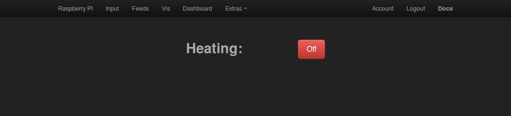
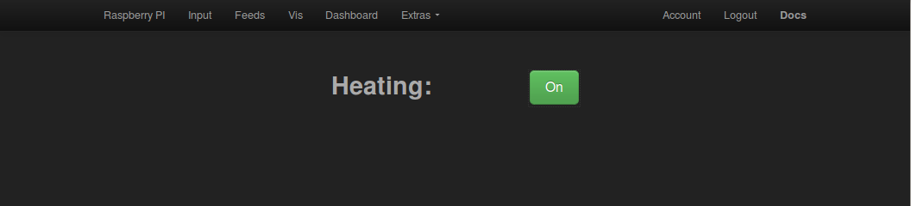
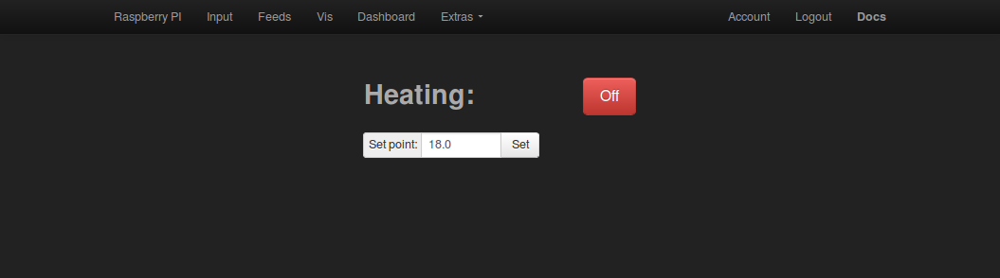
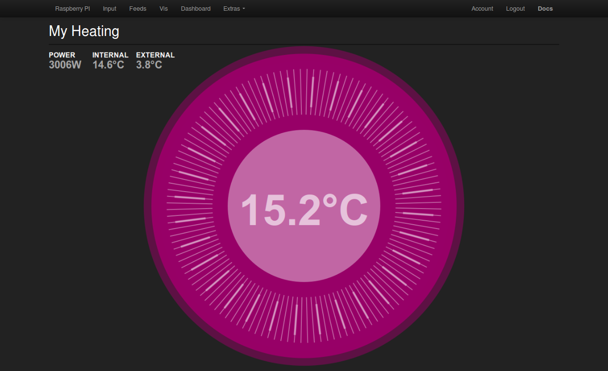
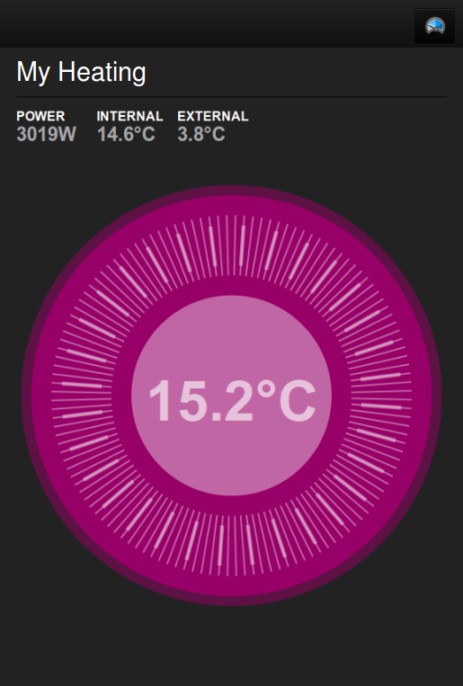
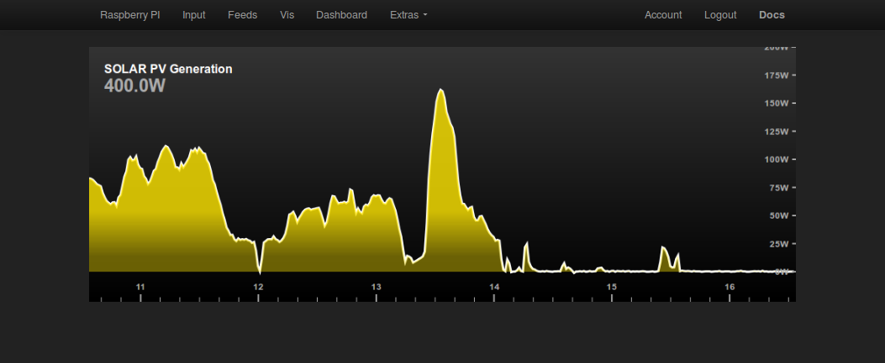
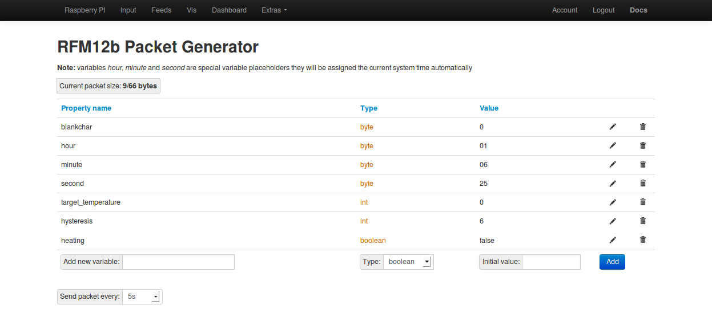

# Control demo's

## Example 1: Heating On/Off

A simple example using a bootstrap styled html button as our heating on/off button. Clicking the button toggles the state and updates the “packetgen” control packet with the new state. 

## Example 2: Heating On/Off plus set point

Very similar to the first example but now with a text input for setting the set point temperature for the room/building. The microcontroller on the control node checks the room temperature and turns on and off the heater depending on the setpoint setting it recieves from emoncms.

## Example 3: Nest inspired dial

A nest inspired dial interface for setting the setpoint temperature. The set point can be adjusted by spinning the dial wheel with your finger:

The dial and page resizes to fit different screen types from widescreen laptop's to mobile phones and tablets and touch can be used to spin the dial.

## Solar PV Generation

Not really control but developing the idea of custom html/javascript canvas based graphics further.

I've always liked the standard “news & weather” app that came with my android phone. It's a good example of how clean an intuitive graphs can be and how touch can be used to browse temperature/humidity at different times of the day.

This example is a start on creating a graph that looks and behaves in much the same way implemented in canvas. 

# What you will need to run these examples

You will need your own installation of emoncms to try these out, such as an emoncms + raspberrypi + harddrive setup.

[RaspberryPI with harddrive](http://emoncms.org/site/docs/raspberrypihdd)

You will also need the packetgen module (installed as default with the harddrive image):

http://github.com/emoncms/packetgen

and this repository 'development':

http://github.com/emoncms/development

Copy the folder titled myheating from this repository to your emoncms/Modules folder.

You should now be able to load the examples by clicking on the My Heating menu item.

The example does not yet allow for any gui based configuration and so assumes that the control packet structure looks like this:

This packet will work with the Arduino electricradiator control node example that can be found here:

[Arduino Examples / electricradiator](Arduino Examples/electricradiator)

This sketch could be run on an emontx with jeeplug relay's attached or other rfm12b + arduino + relay type hardware builds.
