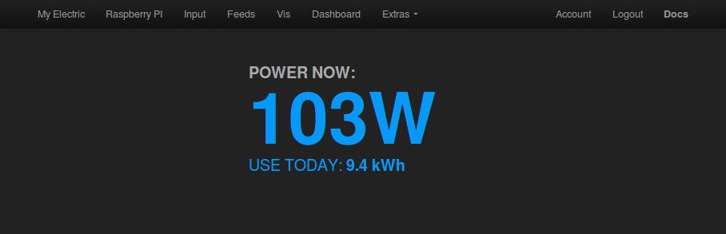
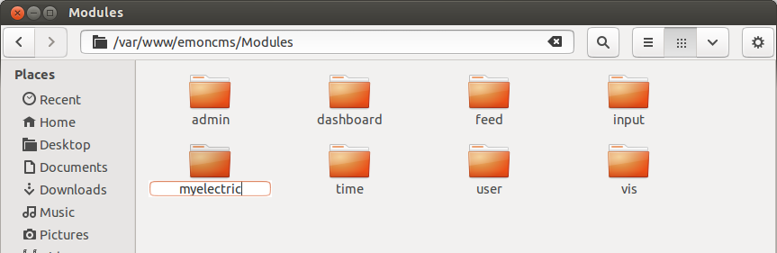
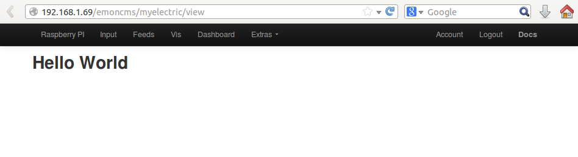

# How to create an emoncms module

In this tutorial we will create a simple custom display module for emoncms that shows a readout of current home power use and how many kwh's have been used today.

## 1) Create a folder for your module

When you open the emoncms directory you will see a folder called Modules, lets call our new module “myelectric”. Create a folder within the Modules folder called “myelectric”.

## 2) The Controller

The most important script (file) that your module needs is a script called the controller. When you go to *http://emoncms.org/myelectric* the module controller is what deals with that request. Create a file called *myelectric_controller.php* in the *myelectric* folder and copy the following code in there:

    <?php

      // no direct access
      defined('EMONCMS_EXEC') or die('Restricted access');

      function myelectric_controller()
      {
        global $session,$route;
        $result = false;

        if ($route->action == "view") $result = "<h2>Hello World</h2>";

        return array('content'=>$result);
      }

**Try it out:** navigate to http://your-ip-address/emoncms/myelectric/view in your browser:

## Important concept: The front controller

When you make a request to emoncms such as:

    http://emoncms.org/myelectric/view

it doesnt actually go to a folder called myelectric and a file called view as you might expect. What actually happens is that: 

     http://emoncms.org/myelectric/view 

is first converted by a file called .htaccess into:

    http://emoncms.org?q=myelectric/view

"myelectric/view" is now the value of the URL property "q" and this argument is passed to index.php wich you will see in the main emoncms folder. This is then used by index.php which is the front controller to tell the application what to load.

## 3) The view

Its best not to build the content (view) in the controller itself as we've done in the simple hello world example above instead we create another file for this which we then load from the controller.

Change the line in myelectric_controller.php:

    if ($route->action == "view") $result = "<h2>Hello World</h2>";

to 

    if ($route->action == "view") $result = view("Modules/myelectric/myelectric_view.php",array());
    
and create a file called myelectric_view.php in the myelectric module folder, type some html in there:

    <h2>Hello World</h2>
    
Im now serving this from myelectric_view.php

**Try it out:** navigate to http://your-ip-address/emoncms/myelectric/view in your browser, you should see hello world again.

### Building the power display

Replace the hello world view code with the following HTML which creates the power display (although the values wont change for now).

    <!-- defenition of the style/look of the elements on our page (CSS stylesheet) -->
    

    <!-- The three elements: title, power value and kwhd value that makes up our page -->
    <!-- margin: 0px auto; max-width:320px; aligns the elements to the middle of the page -->
    

        
POWER NOW:

        
250W

        
USE TODAY: <b>3.2 kWh</b>

    

    
**Try it out:** navigate to http://your-ip-address/emoncms/myelectric/view in your browser, you should see a static version of the screenshot above.

To make the display show an actual power and kwh feed value we need to add a little javascript that periodically get's the latest value of the feeds and then updates the html elements. 

To make this step a little easier the feed module has a library that we can use to request the feed values, which saves us from writting out the AJAX request ourselves. **Note:** this example uses the latest version of the feed.js helper library you may need to update your emoncms installation to get access to the **feed.list_by_id()** function.

Add the following code just below the html code that you copied above in myelectric_view.php:

    <!-- bring in the emoncms path variable which tells this script what the base URL of emoncms is -->
    <?php global $path; ?>

    <!-- feed.js is the feed api helper library, it gives us nice functions to use within our program that
    calls the feed API on the server via AJAX. -->
    

    

**Important:** Set the feed id's to the id's of your power and kwhd feed.

**Try it out:** You should now see the last value of your power and kwh feed but it wont yet be updating periodically. To update the power and kwh value periodically say every 5 seconds we use the javascript setInterval(function,time ms) function. 

Replace the code within the \
    
**Try it out:** navigate to http://your-ip-address/emoncms/myelectric/view in your browser again and the view should be updating every 5 seconds.

## 4) Creating a menu item for the module

Create a file in the myelectric module folder called myelectric_menu.php and add the following menu defenition code to it:

    <?php

      $menu_left[] = array('name'=>"My Electric", 'path'=>"myelectric/view" , 'session'=>"write", 'order' => -2 );

    ?>

Refresh the page, the My Electric menu item will appear top left.

## 5) Setting access permissions

The controller code above did not check if the user is logged in. To only allow access to the page when the user has full read/write permissions change the line in myelectric_controller.php from:

    if ($route->action == "view") $result = view("Modules/myelectric/myelectric_view.php",array());

to

    if ($route->action == "view" && $session['write']) $result = view("Modules/myelectric/myelectric_view.php",array());
    
    
Thats it! you've built an emoncms module. 

