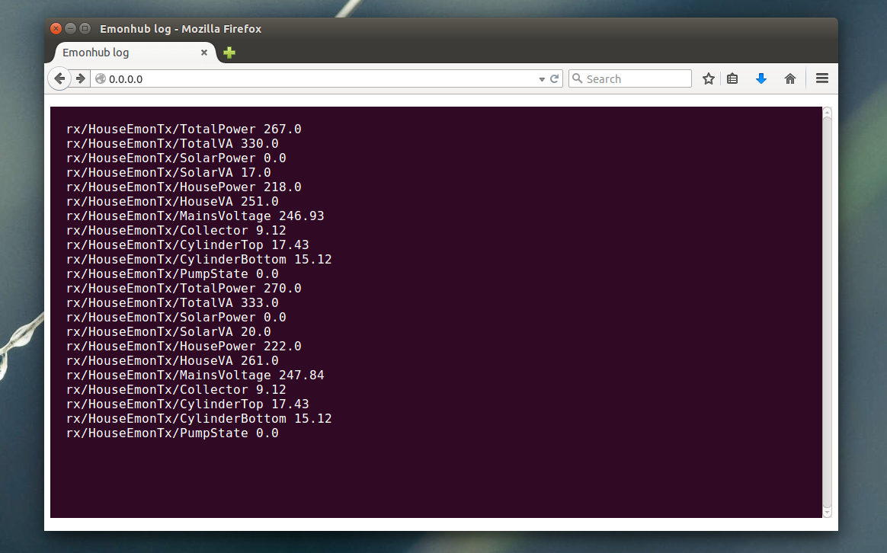

# A Python MQTT/Log Web Console

Using python flask and socket.io this example subscribes to a MQTT topic and pushes messages up to a browser using web sockets based on socket.io. The results are displayed in a html box that looks like a ubuntu linux terminal window. The example includes basic session based authentication with a hardcoded username and password see app.py.

Username: demo, password: demo

The aim is to make it possible to view the emonhub log from a browser rather than having to login via SSH making debugging more convenient.

# Install

    sudo pip install Flask
    sudo pip install Flask-SocketIO

see: https://flask-socketio.readthedocs.org/en/latest/

Code is based on the flask-socketio example
