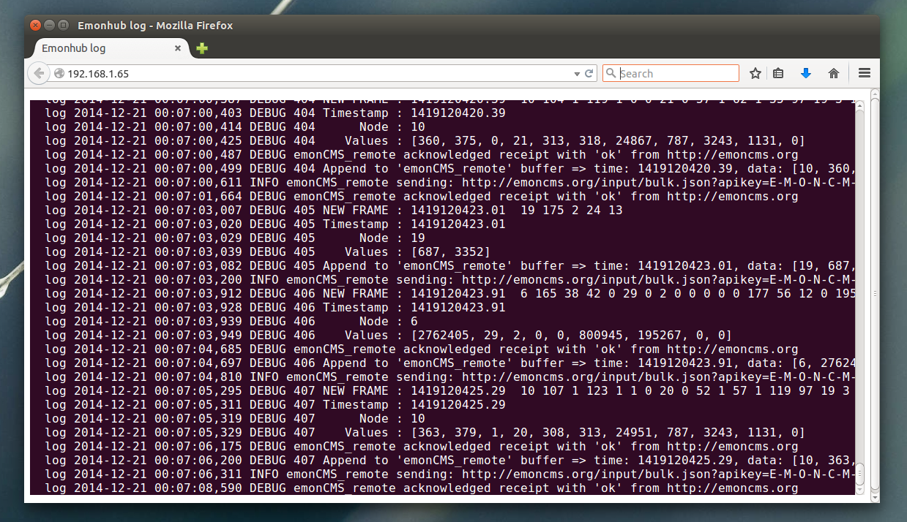

# A Python MQTT/Log Web Console

Creating a browser based EmonHub log console using python, flask, socketio, MQTT

Written in Python using the flask web framework this example subscribes to a MQTT topic to which logs are posted from emonhub and pushes messages up to the browser using socket.io. The results are displayed in a html box that looks like a ubuntu linux terminal window. The example includes basic session based authentication with a hardcoded username and password see app.py.

Username: demo, password: demo

Being able to view the emonhub log from a browser rather than having to login via SSH could make debugging more convenient.

# Install

    sudo pip install Flask
    sudo pip install Flask-SocketIO
    sudo pip install mosquitto
    
Installation of Flask-SocketIO can be slow on a raspberrypi.

see: https://flask-socketio.readthedocs.org/en/latest/

Code is based on the flask-socketio example

### Changes to emonhub

In emonhub.py:

In the import section at the top add:

    import mosquitto

Just below the import section add:

    mqttc = mosquitto.Mosquitto()
    mqttc.connect("127.0.0.1",1883, 60, True)

    class MQTTLogHandler(logging.Handler):
        def emit(self, record):        
            mqttc.publish("log",record.asctime+" "+record.levelname+" "+record.message)
            
            
Lower down, just below the line (line 324):

    logger.addHandler(loghandler)

add:

    mqttloghandler = MQTTLogHandler()
    logger.addHandler(mqttloghandler)

