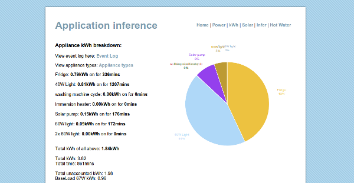
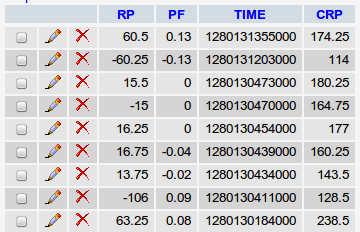
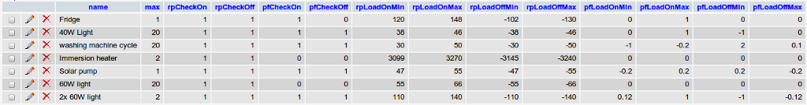

## Appliance Inference

_Draft created 2 August 2010 by Trystan Lea_

### The idea

This page details an ongoing investigation into the possibility of inferring what appliances are on and how much energy they use (especially their kwh per day usage)  from one measurement point at the supply to the house/building. If this can be done effectively it would be a much cheaper and less intrusive way to find out such information than placing a separate meter on each appliance.

**Measuring changes in power consumption and power factor**

A 40W incandescent light bulb should be distinguishable because it would cause a power consumption change of ~ 40W of power, it is a resistive load so its effect on power factor should be either no change or positive change (depending on overall electricity use magnitude and power factor).

A 3kW immersion heater should be distinguishable because it would cause a power consumption change of ~ 3000W of power, it is a resistive load so its effect on power factor should be either no change or positive change (depending on overall electricity use magnitude and power factor).

My refrigerator uses 142W when it starts, then gradually drops to 105W.

The washing machine has a heating element that uses ~2kW for a couple of minutes, and a spin cycle that is highly reactive causing power factor changes of approximately ±0.45

By building up a profile of the types of power consumption and power factor changes that happen in a building, it may be possible to make a rough breakdown of energy used by the different appliances.

### Attempted solution 1

This is both a description of the solution as it currently stands, and a how-to-set-it-up guide. There are still lots of errors and lots of work to do!

1) Set up a database on a server to log events with the following columns: timestamp (TIME), real power change (RP), power factor change (PF), current real power (CRP).

2) Create a script to relay this data from an Arduino GET request, to the database. Place the script on the server [emon.php](emon.php)

3) Get the energy monitoring hardware to send this GET request to the server (minus timestamp which is generated in the script). See arduino sketch inferSketch.pde and EmonEvent library.

4) Create a table that stores event types.

5) Create a php script that:

*   selects both the data in the event type table and the event log table
*   checks the event log data for events of the type described in the event type table. 
*   calculates how much energy each appliance (event type) has consumed.
*   outputs this information in a useful way.

**Download** the event analysis php scripts: [appInfer](appInfer)

**Download** the page theme files: [theme](theme)

**ToDo**

*   Add password security to emonphp relay script.
*   Get the chart to show only kwh of appliances > 0 kwh
*   Work on layout
*   Add a check that turns off appliances if the calculated power is larger than the actual power. At the moment, the inference code often thinks there are more appliances powered on, than actually are. Especially 40W light bulbs!
*   this is by no means a finished list.
