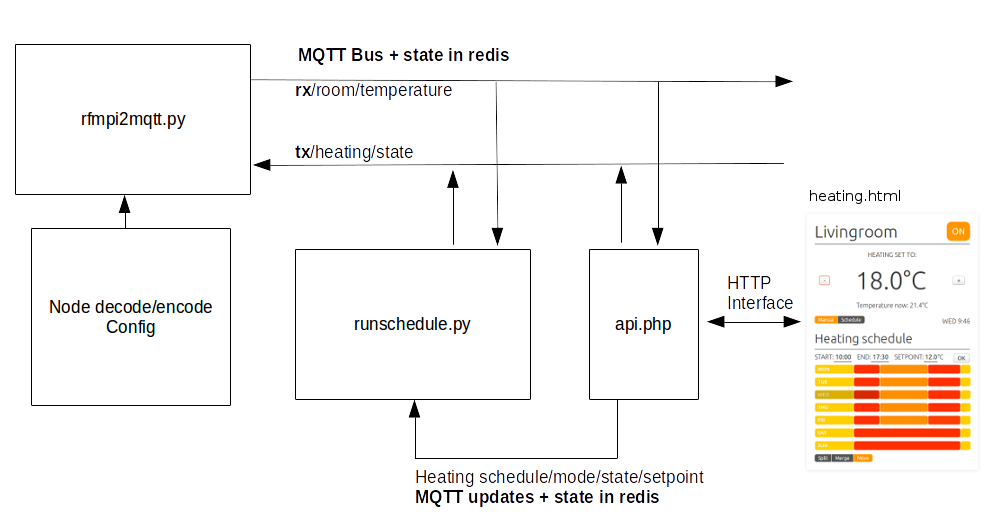

# Heating controller software development

This is work in progress - it has not yet reached a working first release state

## Development Notes:

**rfmpi2mqtt.py** – the bridge between serial IO of rfmpi and MQTT.

**RX:** Node data received is decoded according to config file and posted to rx MQTT topic & redis db

1) Received on serial:

	18,58,7,228,12
	
2) Decoded using config file:
	
	[nodes]

    [[18]]
        nodename = room
        names = temperature, battery
        codes = h, h
        units = C,V
        scale = 0.01,0.001
        
3) Output published to MQTT topic:
	
	*rxtopic/nodename/varname*
	rx/room/temperature		18.5
	rx/room/battery			3.30
	
**TX:** Data can be sent out on rfm network by publishing messages to the tx mqtt topic:

1) Pulish to tx mqtt topic:

	*txtopic/nodename*  csv variables
	tx/heating			1,1810
	
2) Encoded using config file:

    [[30]]
        nodename = heating
        names = state, setpoint
        codes = b, h
        
3) Serial write command to rfmpi:

    30,1,18,7,s

**heating.html** - The scheduler interface provides a UI that generates a schedule object detailing the heating schedule for every day of the week. The heating schedule can be overridden with a manual setpoint and heating state in manual mode. The variables required for this application are:
    
	heating_state			    on/off
	heating_manual_setpoint		<temperature>		
	heating_mode			    manual/schedule
	heating_schedule			<schedule object>

These variables need to be persisted in the server database – (ideally persisted to disk, at the moment the app is using redis which can be configured to persist but its not ideal as you don’t want to persist the regularly updated node data – to reduce disk writes)

**runschedule.py** - The scheduler interface needs to be used in conjunction with an always running script that runs the schedule when the web page interface is not loaded by the user. The scheduler UI needs to pass the above configuration variables to the runschedule.py script.

**api/index.php** - provides a HTTP interface too:

- rfmpi rx: node data received from wireless nodes, ie: room/temperature
- rfmpi tx: used to send data out to the nodes (heating state variables/comands)
- application state data (user schedule)

The main design idea is that any property which might be an: integer, float, json, csv is stored in a server side key:value database (i.e redis in this case) and is also passed to MQTT. The HTTP api url mirror's the database and MQTT key for that variable. When a property is updated it is **both** saved to the redis database and published to a MQTT topic of the same key name. Publishing to MQTT rather than having other scripts poll redis on a ususally slower basis makes it possible for the control application to be very responseive to user input, turning on a light via a relay as soon as a web html button in the browser is pressed.

## Command routing

The scheduler interface could also send commands directly to rfmpi2mqtt.py script controlling heating system but then any changes of state also need to be transferred to the runschedule.py script before runschedule.py sends any commands to rfmpi2mqtt.py.
This provides two possibilities either commands to rfmpi2mqtt are only sent my runshedule.py and so to get fast response runschedule.py needs to receive ui state change via mqtt rather than polling redis.

In the event that runscheduler fails, it may be an advantage if the UI can send commands directly via sever:api to rfmpi2mqtt. That failure of runschedule.py only reduces functionality  rather than completely disabling heating control. 

In both cases whether control is via runschedule.py or if commands can go both directly and via runschedule.py. If you want responsive control, state updates to the heating variables need to be passed to runscheduler via a push mechanism (such as mqtt pub/sub)

## Recording state and changes of state

- program state (schedule object, manual heating settings)
- node rx state (node data, room temperature etc)
- node tx state (command state)

you need control over exactly what is persisted to disk

changes of state are pushed to mqtt topics
state is persisted in redis

# Install

Can be used with emoncms mqttdev branch:
https://github.com/emoncms/emoncms/tree/mqttdev

# Todo

- Service script for rfmpi2mqtt.py
- Service script for runschedule.py
- Add logging to rfmpi2mqtt.py
- Add logging to runschedule.py
- Authentication on integration with emoncms loging authentication for HTTP Api and heating.html page
- Watchdog for service scripts
- Extend heating.html to allow multi-zone control
- Develop android app version of heating.html

# Development questions

In the implementation above node data is published to a MQTT topic key for each node/variable. This works ok for transfering data locally between scripts but if we wanted to dispatch node data to a remote emoncms account translating a mqtt variable update to a http request to emoncms.org for every single input would not be the most efficient way of sending data and would multiply the connection load on emoncms.org considerably. At the moment emonhub has a dispatcher that buffers node data which can in turn contain many node variables. It might be nice to hang dispatchers off the MQTT rx/node/variable bus but to then dispatch an efficient message would require recombination of the individual variables into nodes and would have associated challenges with defining which variable to trigger dispatching with. Perhaps another MQTT topic is required which holds this node data without it having being split into sperate variables.

The current format looks like this:

    data=[
        [0,18,18.5,3.3],
        [5,18,18.5,3.3],
        [10,18,18.5,3.3]
    ]
    &sentat=12
    
where [0,18,18.5,3.3] = [time,node,var1,var2]

perhaps a less space efficient more verbose format could be sent, which would allow naming to be sent to the remote emoncms.org account:

    bulkdata = [
    	{"time":0, "node":"room", "var":{"temperature":18.5, "battery":3.3}}
        {"time":5, "node":"room", "var":{"temperature":18.5, "battery":3.3}}
        {"time":10, "node":"room", "var":{"temperature":18.5, "battery":3.3}}
    ]

or perhaps a dispatcher could create bulk uploads of full keys:

    bulkdata = {
        "room/temperature":{"time":0,"val":18.5},
        "room/battery":{"time":0,"val":3.3},
        "room/temperature":{"time":5,"val":18.5},
        "room/battery":{"time":5,"val":3.3},
        "room/temperature":{"time":10,"val":18.5},
        "room/battery":{"time":10,"val":3.3}
    }

Im not sure it is as nice a solution as the current approach.
