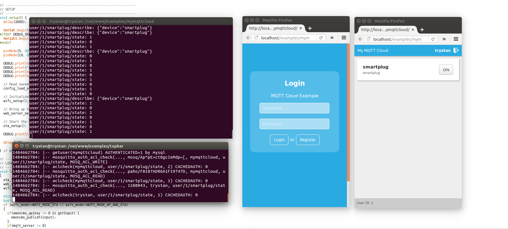

# MQTT Cloud Example

End to end demo of an MQTT Cloud control of ESP8266 Wifi Relay, including:

- Multi-user authentication and access list control using jpmens mosquitto auth plugin with MySQL database.
- Basic PHP server app and javascript client for user creation, login, device list and control.
- Simplified Wifi Relay firmware based on emonESP that runs on Martin Harizanov's [WIFI relay board](https://shop.openenergymonitor.com/wifi-mqtt-relay-thermostat).

Notes on setting up mosquitto & mosquitto-auth-plug + basic demos: [learn_mqtt/readme.md](learn_mqtt/readme.md)

### EmonESP WIFI Relay Firmware

See folder: EmonESP_WIFIRelay

### Demo Database setup

Create database:

    mysql -u username -p
    CREATE DATABASE mymqttcloud;

Create user table:

    CREATE TABLE users (`id` int(11) not null auto_increment primary key, `username` varchar(30), `salt` varchar(32), `hash` varchar(64), `pw` varchar(67), `super` int(11)) ENGINE=MYISAM;
    
Create access list table:
    
    CREATE TABLE acls (`id` int(11) not null auto_increment primary key, `username` varchar(30), `topic` text, `rw` int(11)) ENGINE=MYISAM;

### Running the app

1) Copy contents of repo to html directory of apache server with php, redis, mysql and mqtt support. (Directories learn_mqtt and EmonESP_WifiRelay can be removed).

2) Create the first user as a MQTT super user. Register a new account with secure password and then login to mysql and increase user level to super user with UPDATE users SET super=1 WHERE id=1;

3) Run mosquitto with:

    sudo mosquitto -c /etc/mosquitto/mosquitto.conf

4) **mqtt_worker.py** Open and set mqtt username and password to that of the super user. For testing just run with: 

    python mqtt_worker.py

5) Create another user via web app (this time without super user status) and login. Note down the user ID printed in the footer.

6) Upload EmonESP_WIFIRelay code to WIFI Relay module (the relay is configured on digital 5).

7) Power up the relay module, configure WIFI and enter MQTT username and password to that of the user last created.

8) Set MQTT basetopic to user/USERID/smartplugID (replace USERID with the userid of the account to associate with and ID in smartplugID to a unique number to distinguish between multiple smartplugs)

9) Connect and that should be it. The WIFI relay module should initialise a Smart Plug device in the device list with an ON/OFF button that can be used to switch the relay unit.
